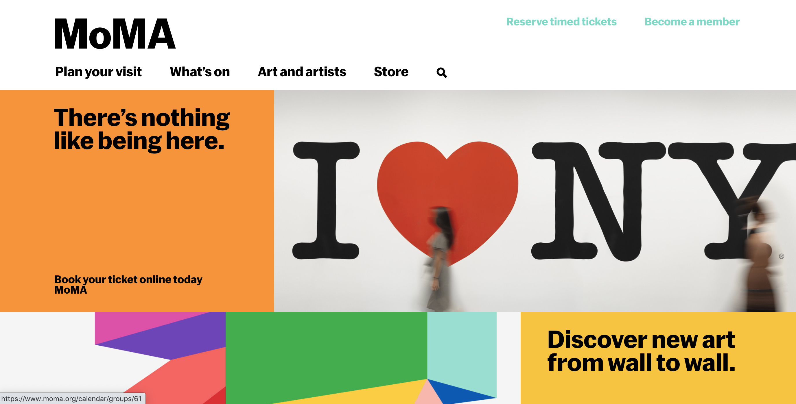
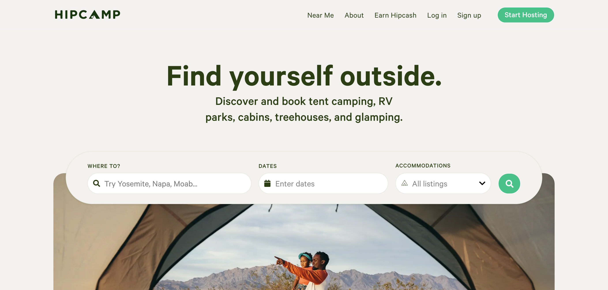

**Summary:** A clear visual hierarchy guides the eye to the most important elements on the page. It can be created through variations in color and contrast, scale, and grouping.

Have you ever encountered a webpage that was so busy with various design elements that you had no idea where to even begin to look? If you struggle to find focus on a screen, it's likely that the layout is missing a clear visual hierarchy.

The page's visual hierarchy controls the delivery of information from the system to the end user — it lets users know where to focus their attention.

> **Visual hierarchy** (of a 2D display (webpage, graphic, print, etc.)): Refers to the organization of the design elements on the page so that the eye is guided to consume each design element in the order of intended importance.

## 1. Color and contrast

Good visual design uses color or contrast (or both) to create visual hierarchy on the page. Applying color to a design makes some elements appear to advance and others to recede, and, thus, determines what grabs our attention and the importance we assign to various design elements.

It's not the actual color of an element that creates the hierarchy, but rather the contrast in value and saturation between the element and the context in which it appears (including background and other nearby elements).

Designers often also use **type contrast** to indicate hierarchy, signaling importance with a special font treatment. Typefaces with heavy weight, like bold, stand out against light-weighted or regular typefaces. Words styled differently than the surrounding text (e.g., italic or underlined) also attract attention.

**Best practices when using color and contrast:**

- **Consider color saturation.** Bright colors naturally stand out, so use them for important items; less-saturated colors can be used for items of lesser importance. Reserve warm bright colors, like red, for warnings or errors.
- **Don't use too many colors.** While some complex color schemes are beautiful to look at, they can feel overwhelming on a webpage. When too many colors of similar value or saturation are used, people's perception of hierarchy among elements is often reduced. In common, uncomplicated designs, limit your color use to 2 primary and 2 secondary colors.
- **Don't use too many contrast variations.** Use no more than 3 contrast variations for complex designs. If everything is contrasted, then nothing stands out. Effective designs often use different treatments for header, subheader, and body text.
- **Do not rely only on color to communicate visual hierarchy.** People with color blindness may not be able to perceive differences between certain color combinations.

## 2. Scale

The [principle of scale](https://www.nngroup.com/videos/scale-visual-principle/) is key in creating visual hierarchy in a design. Bigger elements stand out more and attract users' attention, so size can be used as a marker for importance.

<!-- UNMATCHED: Jersey Dairy Milk: The typographic treatment on this milk carton creates an impactful visual hierarchy through scale variations. The eye is immediately drawn to the most important aspects of the product – the fact that it's milk and its fat content. -->

**Best practices when using scale:**

- **Use no more than 3 sizes** — small, medium, and large. Three sizes provide enough variety to work with — think type size for header, subheader, and body copy — but still keep hierarchical relationships well defined and clear. On web designs, sizes could range from 14px to 16px for the body copy, 18px to 22px for the subheader, and up to 32px for the header.
- **Make the most important element biggest.** Emphasize the most important aspect of your design by making it the biggest. Likewise, make less-important elements smaller. Limit how many elements are big to a maximum of 2 so that they do stand out and reinforce the hierarchy.

## 3. Grouping: Proximity and Common Regions

Implicit and explicit groupings help us see the bones or the structure of a page and allow us to direct attention to those areas of the screen that are likely to be relevant to our goal. Without groupings, it would be a lot more difficult to understand where standard areas such as navigation, content, ads are and, thus, it would be harder to figure out where to direct attention and which areas can be safely ignored. For example, once users identify a right-rail group, they may ignore it due to its association with ads — an instance of [banner blindness](https://www.nngroup.com/articles/banner-blindness-old-and-new-findings/).

Grouping is usually conveyed implicitly through [proximity](https://www.nngroup.com/articles/gestalt-proximity/) and the use of white space or explicitly through enclosure ([common region](https://www.nngroup.com/articles/common-region/)).

![Shopify checkout form fields: The proximity principle is apparent in good form design. The minimal white space between the section headers and related form fields makes the relationship clear — they belong together. There is also increased space between each chunk of fields, which further helps the eye see this hierarchical spatial pattern. Note also the boundary around the two Express checkout buttons (an example of the principle of common region), which separates them from the checkout form below.](shopify.png)

**Best practices for groupings:**

- **Let it breathe.** An element that has more space around it will be perceived as one group and thus will receive more attention. (If the group contains many elements, the attention will likely be divided among them.) Consider emphasizing the most important aspect of your design by giving it more space.
- **Consider using a container.** If varying whitespace alone is not enough of a visual cue to create hierarchy, add extra elements like borders or backgrounds. These additional elements can create visual clutter, so use them sparingly.

## The Squint Test

In design school, we are taught to squint or apply a slight blur to the design to get an idea of the conveyed groupings and hierarchy. This technique highlights what is emphasized in the design and uncovers the underlying hierarchy.

In the Spotify example above, blurring the design with a radius of 5 or 10 pixels shows that the groupings work as intended and that the *Recently Played* section stands out the most even when you can't read the text. The 20-pixel blurring shows an unintended hierarchy, with one of the recently played items being the most prominent element of the page due to its strong color — an effect also discernible in the original screenshot.

This example shows that it's not enough to design the template — you must also consider the content that will fill it. For example, a news photo with extremely strong colors might dominate a news homepage even if it's intended to illustrate a secondary story. Editors need to take into account the UX implications of their content choices.

## Conclusion

Before beginning a design, take a step back from the visuals and define the hierarchy of the content and the key point(s) you want the user to take away. Once you establish that hierarchy, focus on applying variations in color and contrast, scale, or grouping. After designing with visual hierarchy in mind, step back and see if the design reads as you intended it by testing with target users.

When the page's visual hierarchy accurately reflects the importance of different design elements, users easily understand it and can successfully complete tasks, thus gaining trust in the design and the brand.

### References

Davis, M., & Hunt, J. (2017). *Visual Communication Design.* Bloomsbury Visual Arts.

Lupton, E. (2008). *Graphic Design: The New Basics.* New York: Princeton Architectural Press.
